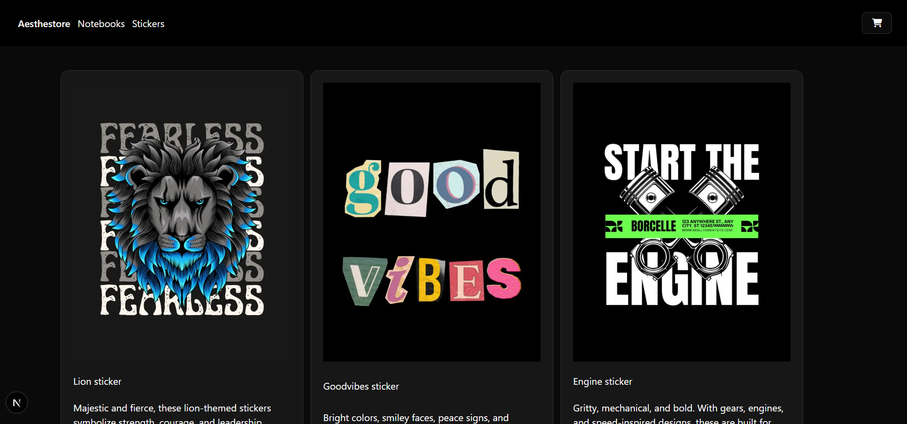
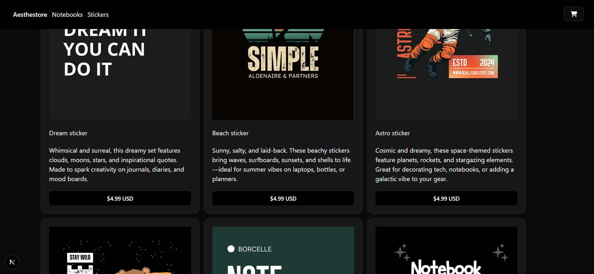
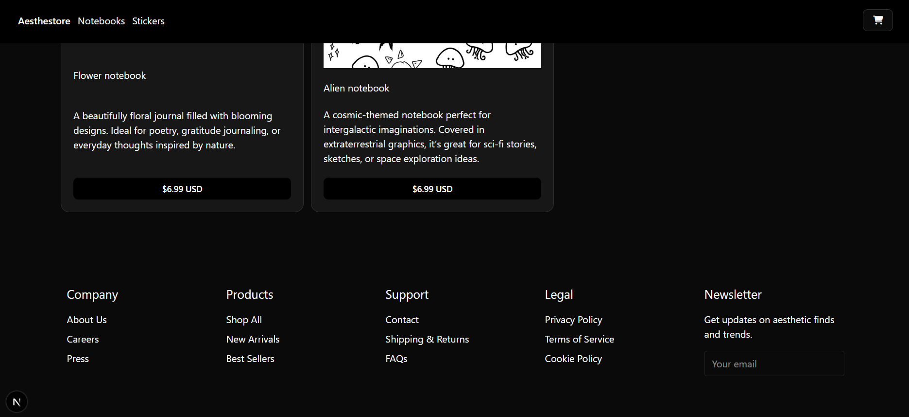
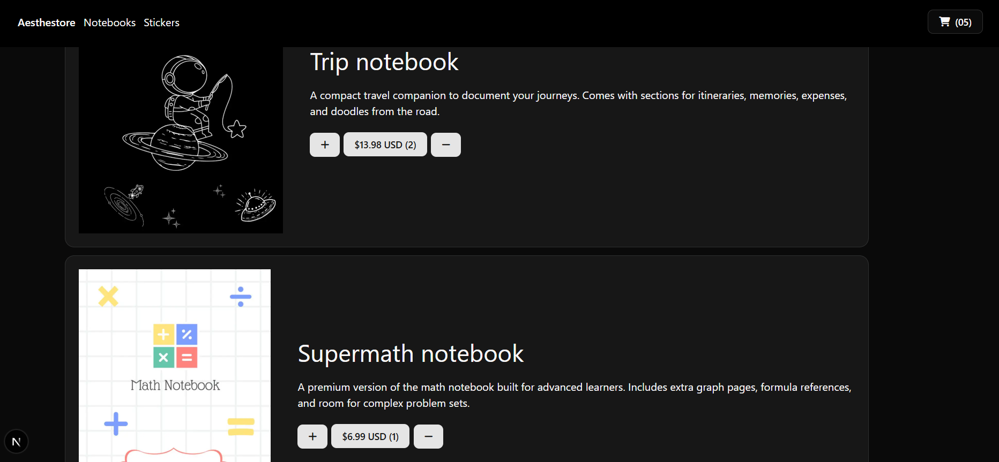
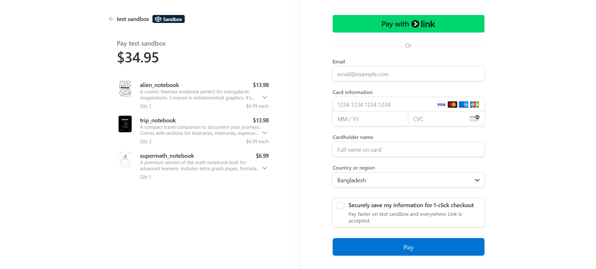
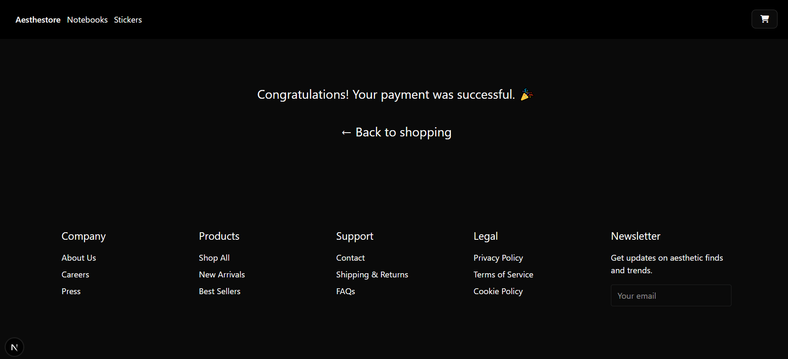

# Aesthetic Sticker & Notebook Shop - Built with Next.js, Stripe & ShadCN

Welcome to **Aesthestore** – a minimalist and aesthetic online shop built with **Next.js**, fully integrated with **Stripe** for secure payment processing. This project showcases a smooth frontend shopping experience, real-time cart updates, and a seamless checkout flow powered by Stripe.

## 🚀 Features

- Fast, modern Next.js 15 frontend
- Stripe integration with support for:
  - Multiple product types (stickers & notebooks)
  - Quantity selection
  - Real-time cart updates
  - Secure Checkout Sessions
- Dynamic product fetching from Stripe's Products & Prices API
- Global Cart Management using React Context API
- Aesthetic and component-based UI with [ShadCN UI](https://ui.shadcn.com/)
- Dev-ready with ESLint, TypeScript, and modular structure

## Tech Stack

- **Frontend**: [Next.js](https://nextjs.org/)
- **UI Components**: [ShadCN UI](https://ui.shadcn.com/)
- **State Management**: React Context API
- **Styling**: Tailwind CSS (via ShadCN)
- **Payments**: [Stripe Checkout](https://docs.stripe.com/api?lang=node)
- **Data Fetching**: REST (Stripe SDK), Axios
- **Icons**: Font Awesome (Free)

## Screenshots

> 

> 

> 

> 

> 

> 

> 

## Setup & Installation

### 1. Clone the Repository

```bash
git clone https://github.com/your-username/sticker-shop.git
cd sticker-shop
```

## Code

- [GitHub Repo](https://github.com/IsteakShupto/aesthestore)

## Contact

- Feel free to reach out or connect on [LinkedIn](https://linkedin.com/in/shupto006) for feedback, collaboration, or just to say hi!
